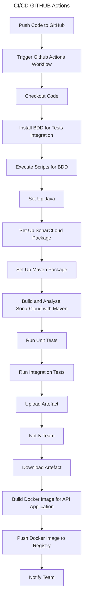

```mermaid
---
title : CI/CD GITHUB Actions
---
graph TD
    A[Push Code to GitHub] --> B[Trigger Github Actions Workflow]
    B --> C[Checkout Code]
    C --> D[Install BDD for Tests integration]
    D --> E[Execute Scripts for BDD]
    E --> F[Set Up Java]
    F --> G[Set Up SonarCLoud Package]
    G --> H[Set Up Maven Package]
    H --> I[Build and Analyse SonarCloud with Maven]
    I --> J[Run Unit Tests]
    J --> K[Run Integration Tests]
    K --> L[Upload Artefact]
    L --> M[Notify Team]
    M --> N[Download Artefact] 
    N --> O[Build Docker Image for API Application]
    O --> P[Push Docker Image to Registry]
    P --> Q[Notify Team]
```